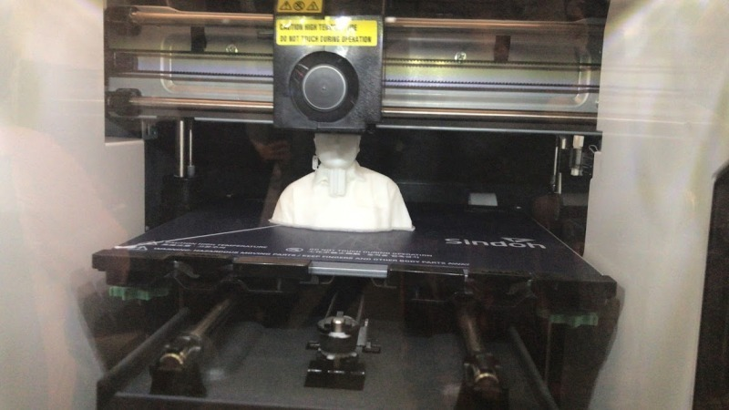
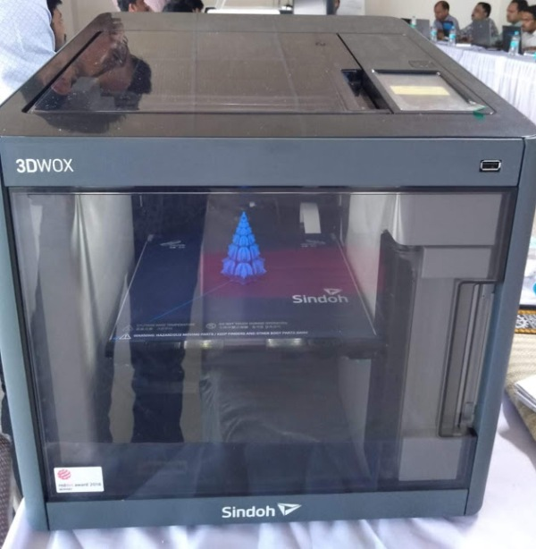
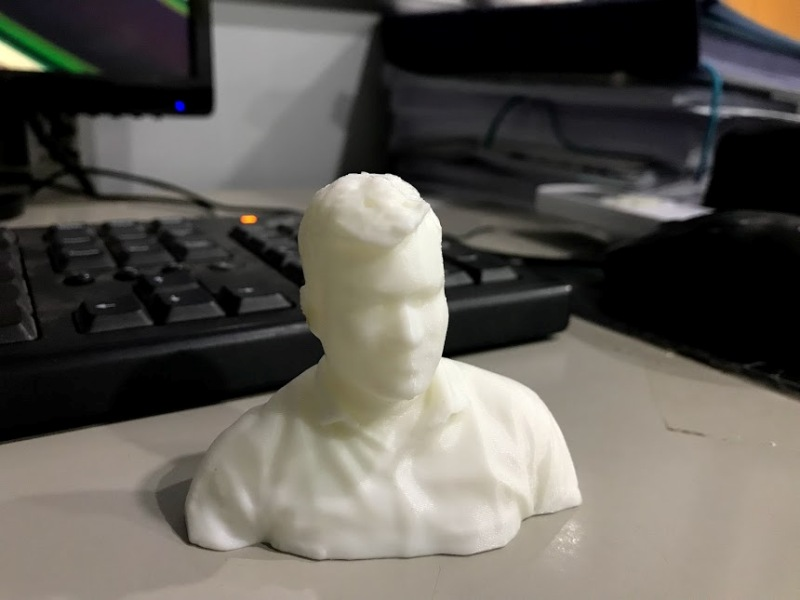

# fabzero
# 3D Printer
3D printing or additive manufacturing is a process of making three dimensional solid objects from a digital file.
The creation of a 3D printed object is achieved using additive processes. In an additive process an object is created by laying down successive layers of material until the object is created. Each of these layers can be seen as a thinly sliced horizontal cross-section of the eventual object.
3D printing is the opposite of subtractive manufacturing which is cutting out / hollowing out a piece of metal or plastic with for instance a milling machine.
3D printing enables us to produce complex (functional) shapes using less material than traditional manufacturing methods.
3D printing is a process where a three-dimensional object is made by joining material in a computer controlled way. There are several techniques to join the material; melting plastic and laying it on top of each other (FDM or fused deposition modeling), fusing powder together or fusing liquid molecules together. The 3DWOX printer makes objects by stacking different layers of molten plastic on top of each other. Some examples Some examples 3D-printing can be used for didactical material, design objects, technical pieces, toys, medical purposes, ...
Different steps There are different steps needed to create a physical object with printing. • First there is a computer model needed. • The model needs to be translated to a model that the 3D printer can read. • Print the object on the printer. 
1.	Import files in 3DWOX Send file to printer print the model.
2.	Model Download the model To be able to print a model it is necessary to start from a 3D-model on the computer. A 3D-model is drawn on the computer. 3DWOX printer needs to be sliced in this software. Setup software for first use with the printer choose printer • Start by opening up the Sindoh 3D WOX software. •  This will make sure that the software will generate the correct code for our 3D-printer. Set Up 3D-model for 3D-printing Load/import 3D-model Import a 3D-model. This needs to be a .STL, .OBJ or .PLY file. Click the Load folder icon on the top left corner of the screen, select your 3D-file in the browser, and click “open.” The model will now show up on the build platform.
3.	The 3D printing design can be drawn using the free Freecad software
4.	This printer uses the polylactic cartridge and single colour can be used at a time and it is having the thickness of 1.75 mm in diameter and 700 grms per cartridge.

