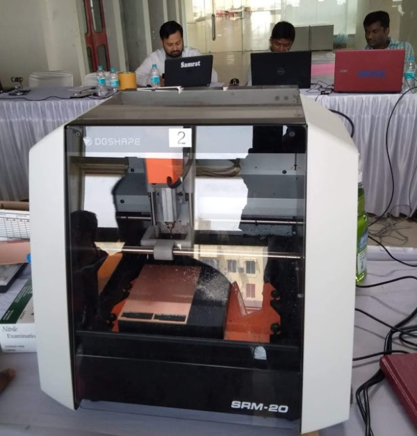

# Fomlab
3D printing or additive manufacturing is a process of making three dimensional solid objects from a digital file.
The creation of a 3D printed object is achieved using additive processes. In an additive process an object is created by laying down successive layers of material until the object is created. Each of these layers can be seen as a thinly sliced horizontal cross-section of the eventual object.
Stereolithography (SLA)
The most commonly used technology in this processes is Stereolithography (SLA). This technology employs a vat of liquid ultraviolet curable photopolymer resin and an ultraviolet laser to build the object’s layers one at a time. For each layer, the laser beam traces a cross-section of the part pattern on the surface of the liquid resin. Exposure to the ultraviolet laser light cures and solidifies the pattern traced on the resin and joins it to the layer below.
After the pattern has been traced, the SLA’s elevator platform descends by a distance equal to the thickness of a single layer, typically 0.05 mm to 0.15 mm (0.002″ to 0.006″). Then, a resin-filled blade sweeps across the cross section of the part, re-coating it with fresh material. On this new liquid surface, the subsequent layer pattern is traced, joining the previous layer. The complete three dimensional object is formed by this project. Stereolithography requires the use of supporting structures which serve to attach the part to the elevator platform and to hold the object because it floats in the basin filled with liquid resin. These are removed manually after the object is finished.
SLA is famous for being the first 3D Printing technology: its inventor patented the technology back in 1986. If parts of very high accuracy or smooth surface finish are needed, SLA is the most cost-effective 3D printing technology available. Best results are achieved when the designer takes advantage of the benefits and limitations of the manufacturing process.
•  The build platform is first positioned in the tank of liquid photopolymer, at a distance of one layer height for the surface of the liquid.
•  Then a UV laser creates the next layer by selectively curing and solidifying the photopolymer resin. The laser beam is focused in the predetermined path using a set of mirrors, called galvos. The whole cross sectional area of the model is scanned, so the produced part is fully solid.
•  When a layer is finished, the platform moves at a safe distance and the sweeper blade re-coats the surface. The process then repeats until the part is complete.
•  After printing, the part is in a green, no-fully-cured state and requires further post processing under UV light if very high mechanical and thermal properties are required.
The liquid resin is solidified through a process called photopolymerization: during solidification, the monomer carbon chains that compose the liquid resin are activated by the light of the UV laser and become solid, creating strong unbreakable bonds between each other. The photopolymerization process is irreversible and there is no way to convert the SLA parts back to their liquid form: when heated, they will burn instead of melting. This is because the materials that are produced with SLA are made of thermoset polymers, as opposed to the thermoplastics that FDM uses.

