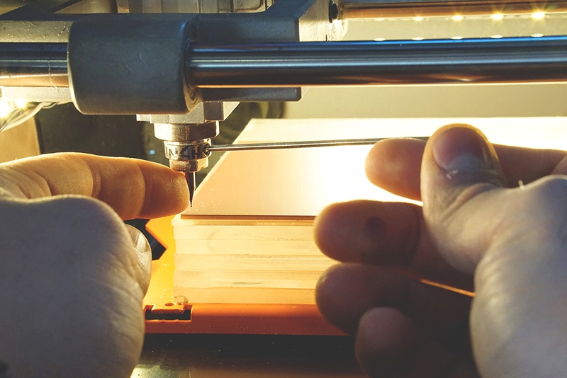
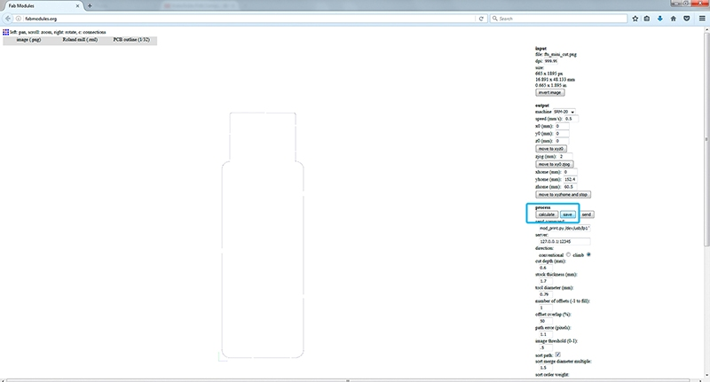
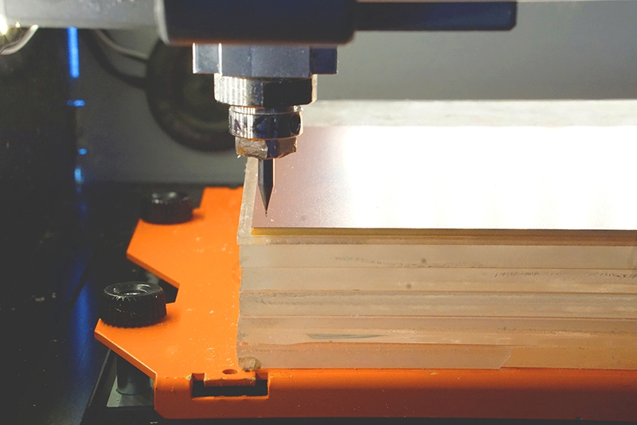
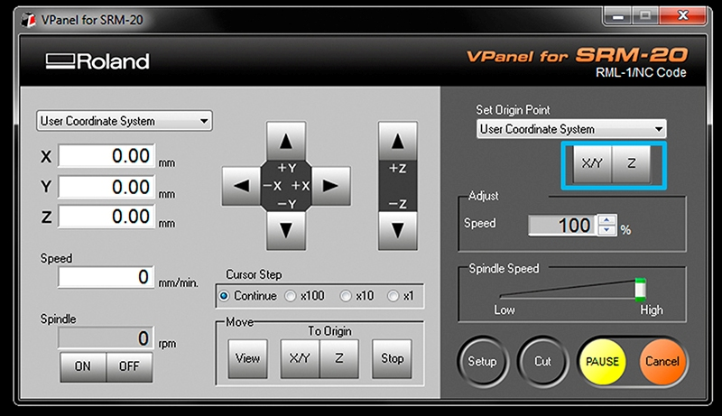
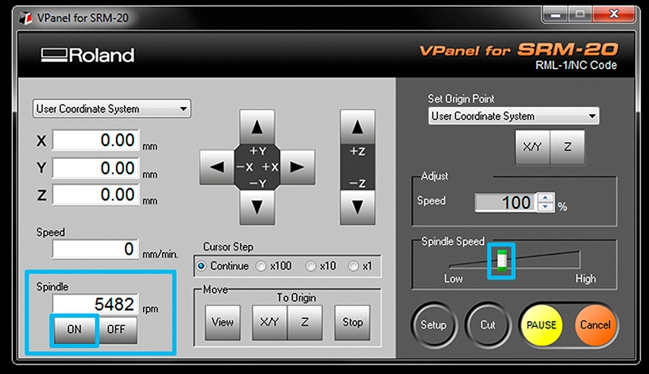
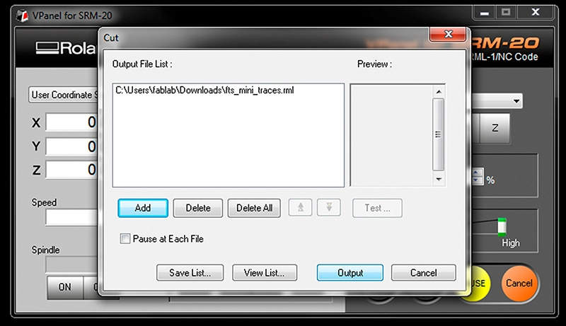

# SRM20
# Summary:
•	Turn on Modela, turn on the windows computer near it. Connect if needed.
•	Create and save file of circuit board traces and outcut.
•	Physically load circuit board and 1/64” endmill to Modela.
•	Find zero for x, y, and z. 

Set settings on the computer to mill then send to Modela.
•	Mill your PCBs
•	Remove board, cut out if desired, cut apart any areas that didn’t make it.
•	Finally, solder your components to your freshly made board!
# Step 1 obtain the files:: Find or Design a Circuit Board
Export/save your board design as .png, You should have two or three images, depending on your PCB: 

* traces 

* holes drill 

* outline
As an example of an PCB this tutorial will use the new FabTinyISP others FabIsp option can be found here 

A handy free program to do design circuits yourself, is Eagle.
# Step 2: fab modules - Traces (1/64)
Open fab modules in your browser recommended firefox/chrome 
Open your traces image file (This is the one with lines that will form the wires between your components.) 

* input format - PNG - select your traces image 

* output format - roland mill (.rml) 

* process - PCB traces (1/64)

•	Machine - SRM-20
•	x0(mm) - 0
•	y0(mm) - 0
•	z0(mm) - 0
•	zjopg - 12
•	Speed - 4 or 3 mm/s for new end mills
# Step 3: fab modules - Outcut/Holes
Refresh fab modules
Now your outline/holes image file 

* input format - PNG - select your traces image 

* output format - roland mill (.rml) 

* process - PCB outline (1/32)
•	Machine - SRM-20
•	x0(mm) - 0
•	y0(mm) - 0
•	z0(mm) - 0
•	zjopg - 12
•	Speed - 0.5
Click “calculate”(you should see a blue path) and after “save”
# Step 4: Tape down your board in the Modela
Turn on Roland Modela and the computer and open VPanel for SRM-20 
A nice tip is to warm the spindle for 10 min at mid Rpm before using it.
Get a circuit board blank ready. Clean off the dust and fingerprints. No, for real, go do that. Then avoid getting more fingerprints on them.
There should be a piece of wood/acryl taped down on the machine securely already. 
This is known as the “sacrificial board” because you mill into it so you don’t mill the own machine. 
Make sure it’s steady and flat. 
Clean the residues of any dust or particles. Help you with a spatula for that task.

Apply double sided tape all the way across (see photo). 
Make sure it’s flat as well, with no folds, particles or overlaps under or on it.
# Step 5: Set the X/Y/Z zeros
You may want to start your file slightly inside your physical board. The (0,0) of your file created in fab modules is in the bottom left corner.
A good starting point is just a few milimiters inside. Move the machine to its position by using the X/Y arrows in VPanel for SRM-20

Decide where to set the origin on your board.It depends on where you taped your board. When you have choosen the position click on Set origin X/Y in Vpanel
Set Z zero,the Z is slightly more complicated

Move the Z slowly with the control panel around 3-5 mm above the PCB plate. 
Now we are going to do the Z manually by loosing the collect screw and land the endmill on the surface.
Slowly loosen the mill bit with an allen wrench so that it 
drops gently to the surface of your board.
Press “slightly down” the PCB board, around 0.5mm and tight the endmill with the screw on the collet.
Now save the Z origin in the Vpanel control panel.
# Step 6: Send the traces!
Click “Cut” on the control panel. 
A new window will appear where you will select your traces cutting file, now click Output and the machine should start. 
You can send multiples files at once if you have set differents origins in fabmodules
If you are doing a lot of offset and producing a lot of residues you may want to carefully brush away some by pausing the cut and brushing them off the bit. Otherwise sometimes it will not make clean cuts. To continue close the front panel and click “resume”.
# Step 7: Send the outcut/holes!
When the machine stops, you will have to vacuum to see the traces.Do not remove the board! 
* Now we are going to repeat the same Z origin procedurebut before we have to change the end mill to use the 1/32 end mill. 
* After zeroing the Z (only the Z)click “CUT” again in the control panel but now choose your Outcut/Holes files and click Output.

Only set the origin Z or you will not be able to match the last origin X/Y

When the machine stops,remove your board with the help of a spatula,don’t be Hulk or you will break the board.Vacuum away the plastic and metal chips in the area. 
Enjoy your PCB and Clean your mess and files after you’re done working!

