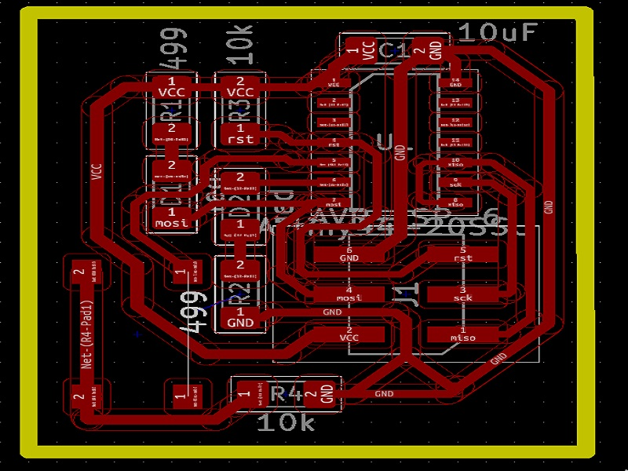

# fabzero  

1.A vinyl cutter is a uses a computer-controlled blade to cut out shapes designed using vector graphics. The vinyl cutter is primarily used for cutting vinyl into signs or stickers, but can also be used to cut copper tape into circuit traces.

This tutorial uses Inkscape to prepare files for the vinyl cutter. 
2.A vinyl cutter is a uses a computer-controlled blade to cut out shapes designed using vector graphics. The vinyl cutter is primarily used for cutting vinyl into signs or stickers, but can also be used to cut copper tape into circuit traces.  
3.Your vinyl cutter files must contain only vectors. 
4.The vectors must be lines only, with no fill.
The vinyl cutter drivers can only interpret cut lines.
All vectors must be contained within the bounds of the document canvas.
Document Setup 
You will need to size your page in your drawing program appropriately for the width of vinyl that you are using. Vinyl comes in two widths, 24" and 15".
Machine rollers will take up 1" on either side of the vinyl.
Select a roll of vinyl and place it on the rollers behind the machine.
On the back right of the machine you will see a lever; place it in the "down" position so you can load the vinyl.
Make sure the vinyl side is facing up as you feed it through the rollers into the vinyl cutter.
Under the rubber wheels there is a white sticker indicator.
Ensure that the vinyl is aligned properly under the rubber wheels.
The left wheel must always be under the wide white sticker on the left
The right rubber wheel must be under any one of the three white stickers on the right, depending on the width of your vinyl.  
Then we created username and user email in the git login After the Successfull installation we did cloning of the readme file by copying the address and then we tried updating the file and then we saved the file by commit and then pushing the file to the repository. Then we have started taking pictures of the equipment's and uploading in the repository. After that we had lunch break. After the lunch break we sorted out inventory of electronic devices. Next Mentor briefed us about the functionality of the 3D Printer, unloading of the filament, cleaning of the waste, cooling procedure of the printer, etc. And next Mentor briefed us about the Vinyl cutter, how to load the sheet, how to keep the edge points on the sheet. Next we had tea break. We installed 3DWOX software for 3D printing Did all the documentation of today's work in the reposito  

